# 🗳️ELECTRA

ELECTRA is a futuristic, immersive democracy interface designed to empower voters, enhance civic education and streamline the electoral process across India. Built with cutting-edge technologies, it bridges the gap between advanced AI capabilities and grassroots democratic participation.

🌐 **Live Demo** → https://electra-xtqb.onrender.com

## 🌌 Quick Glance
<p align="center">
  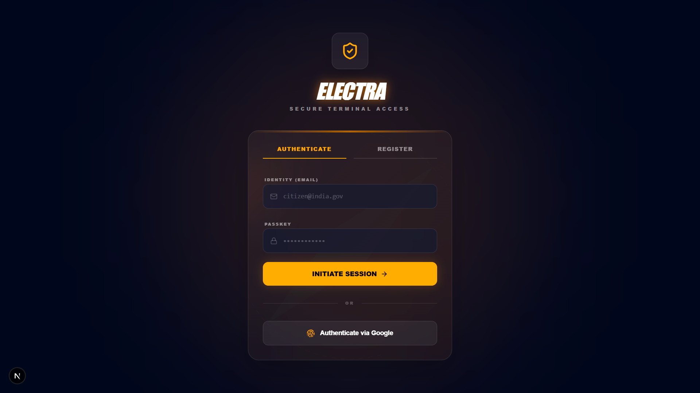<br>
  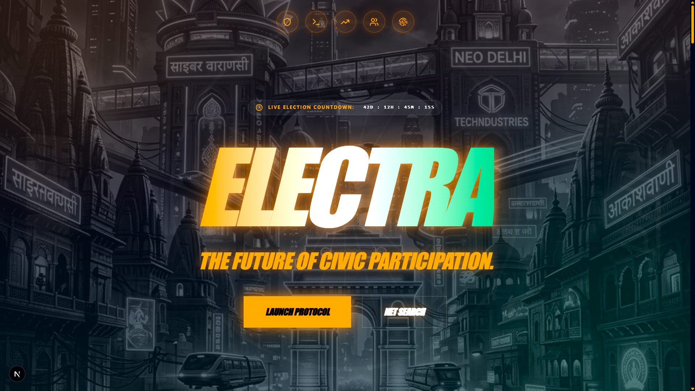<br>
  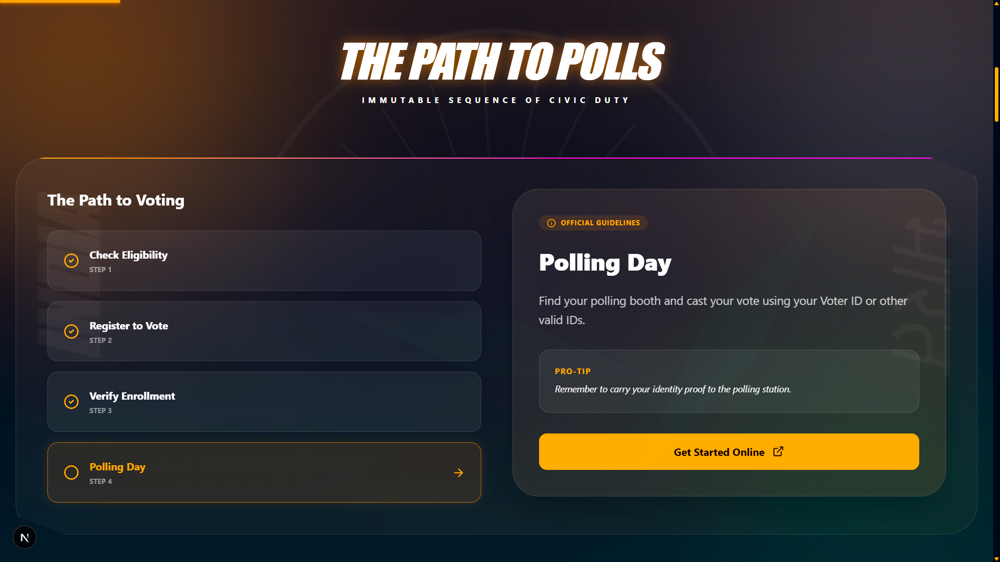<br>
  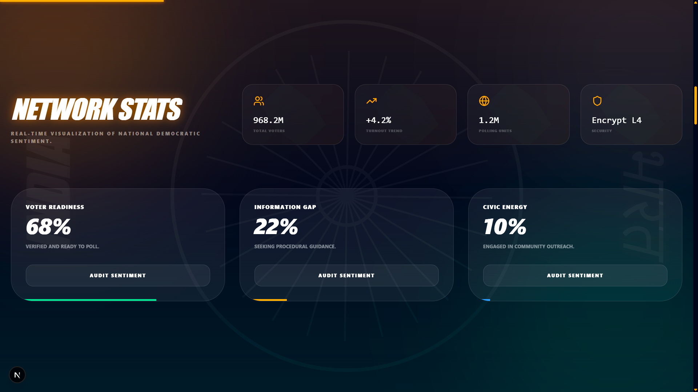<br>
  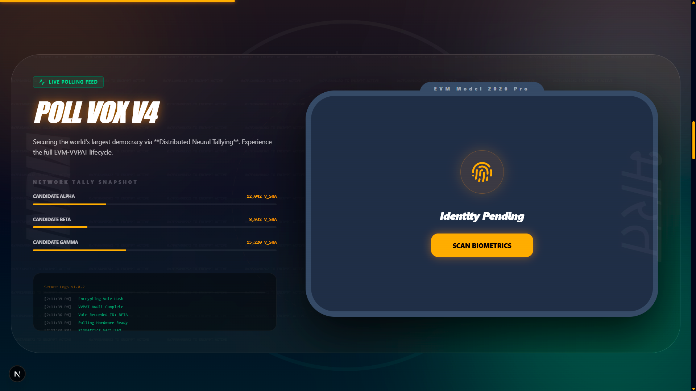<br>
  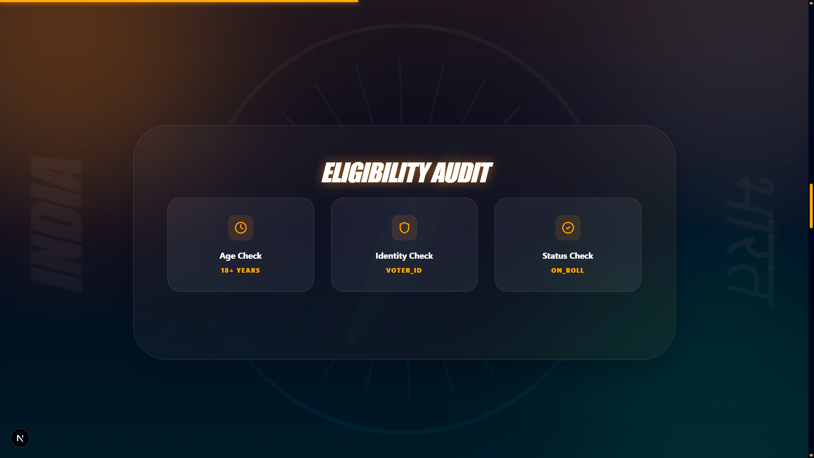<br>
  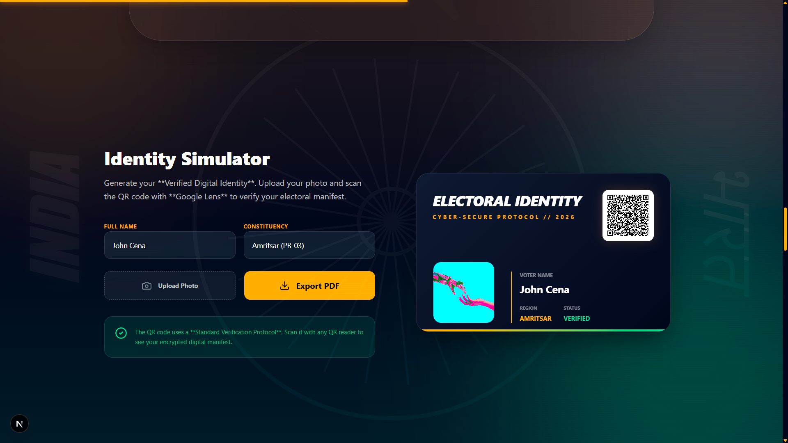<br>
  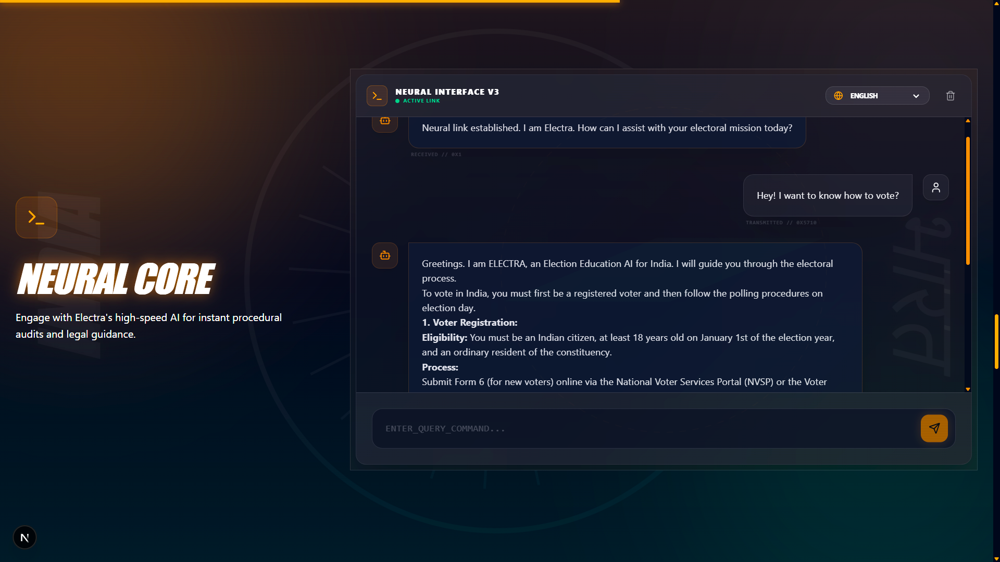<br>
  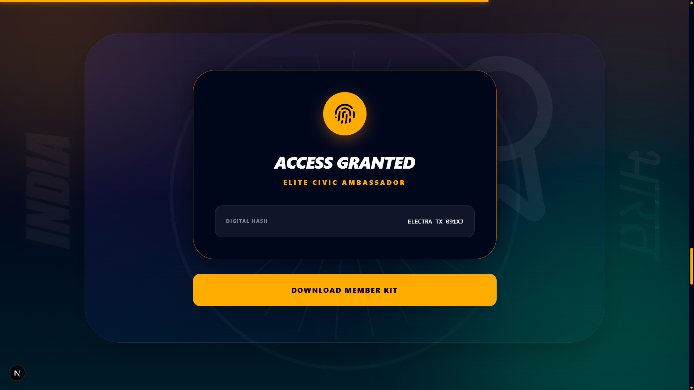<br>
  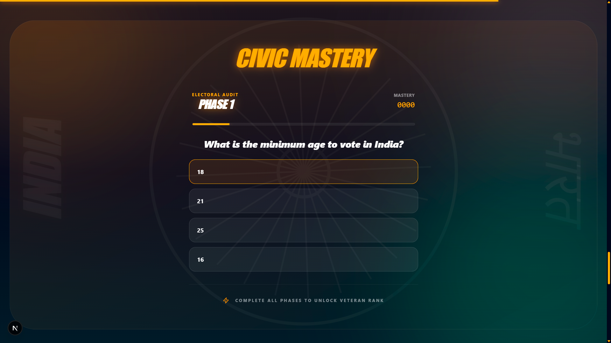<br>
  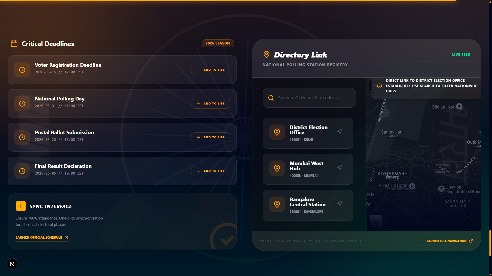<br>
</p>

## 🚀 Core Features
- **🔮 Neural Core (AI Assistant)** - High-speed AI integration using the Gemini API for instant procedural audits, legal guidance and election FAQs.
- **📊 Network Stats & Sentiment Matrix** - Real-time visualization of national democratic sentiment and voter readiness trends.
- **🕹️ EVM Simulator** - A safe, interactive environment to understand how Electronic Voting Machines operate.
- **🪪 E-Identity Simulator** - Generate a secure, digital Voter ID card preview.
- **🛡️ Eligibility Audit** - A step-by-step automated protocol to verify age, identity and electoral roll status.
- **🎯 Civic Mastery Quiz** - Gamified educational tool to test knowledge on democratic processes.
- **📍 Location & Schedule Tools** - Find local polling stations using Google Maps and sync election dates to your calendar.

## 🛠️ Technology Stack
- **Frontend** - Next.js 16 (React 19)
- **Styling** - Tailwind CSS, Framer Motion (for futuristic micro-animations)
- **AI Integration** - Google Gemini AI
- **Database & Auth** - Firebase
- **Mapping** - Google Maps JavaScript API
- **Utilities** - html2canvas, jsPDF, QRCode.react

## ⚙️ Installation & Setup
Follow these steps to run ELECTRA locally -

### 1. Prerequisites
- Node.js (v18.18.0 or later recommended)

### 2. Clone the Repository
```bash
git clone https://github.com/iamhriturajsaha/ELECTRA.git
cd ELECTRA
```

### 3. Install Dependencies
```bash
npm install
```

### 4. Environment Configuration
Create a `.env.local` file in the root directory and populate it with your credentials -
```env
NEXT_PUBLIC_FIREBASE_API_KEY=your_firebase_key
NEXT_PUBLIC_FIREBASE_AUTH_DOMAIN=your_auth_domain
NEXT_PUBLIC_FIREBASE_PROJECT_ID=your_project_id
NEXT_PUBLIC_FIREBASE_STORAGE_BUCKET=your_storage_bucket
NEXT_PUBLIC_FIREBASE_MESSAGING_SENDER_ID=your_sender_id
NEXT_PUBLIC_FIREBASE_APP_ID=your_app_id
GEMINI_API_KEY=your_gemini_api_key
```

### 5. Run the Development Server
```bash
npm run dev
```

## 🧠 Challenges Faced
1.  **State Management in Immersive UI** - Synchronizing real-time countdowns, user selections and dynamic visualizations across interactive sections without performance drops.
2.  **Next.js Standalone Builds & Environment Variables** - Resolving strict separation between build-time (`NEXT_PUBLIC_`) and runtime variables (`GEMINI_API_KEY`) when bundling for Docker containers.
3.  **Accessibility vs. Futurism** - Maintaining semantic HTML architectures for assistive readers while implementing a highly animated, neon-glow aesthetic.

## 🔮 Future Enhancements
- **🔗 Blockchain Verification** - Exploring zero-knowledge proofs for transparent ballot auditing.
- **🗣️ Regional Language Models** - Expansion of the Neural Core into vernacular Indian languages.
- **🌍 Hyperlocal Analytics** - Aggregating real-time data down to specific constituency levels.
